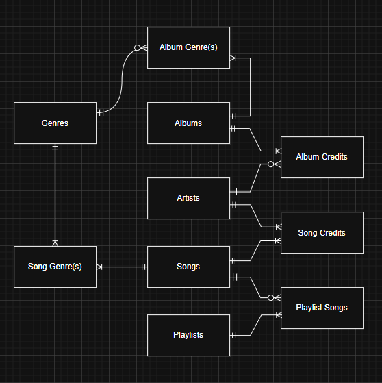

# Design Document

By Armend Bytyci

Video overview:

## Scope

The database for CS50 SQL includes all entities necessary to facilitate the process of searching for music that people like. As such, included in the database's scope is:

* Artists, including basic identifying information and links to other tables
* Songs, including basic identifying information and links to tables with credits information
* Albums, including basic identifying information and links to tables with credits information
* Playlists, including basic identifying information and links to other tables with member songs information

Other

## Functional Requirements

This database will support:

## Representation

Entities are captured in MySQL tables with the following schema.

### Entities

The database includes the following entities:

#### Artists

The `artists` table includes:

* `id`, which specifies the unique ID for the artist as an `UNSIGNED INTEGER`. `id` is assigned from MySQL, and that is ensured by using the ` AUTO_INCREMENT` keyword offered by MySQL. This column thus has the `PRIMARY KEY` constraint applied.
* `first_name`, which specifies the artist's first name as `VARCHAR`, as `VARCHAR` works well for string types. Moreover, 20 is passed to `VARCHAR` offering a space of max 20 characters which is expected to be enough.
* `last_name`, which specifies the artist's last name as `VARCHAR`, as `VARCHAR` works well for string types. Moreover, 20 is passed to `VARCHAR` offering a space of max 20 characters which is expected to be enough.
* `stage_name`, which specifies the stage name adopted by the artist, which may be different from their legal first and last name. Similar to the `first_name` and `last_name` columns, `stage_name` is specified as `VARCHAR`for the same reasons. The only difference is that `stage_name` can accept strings with up to 35 characters.
* `birthday`, which specifies the artist's birthday which as a `DATE` type. The `DATE` type accepts dates in the `YYYY-MM-DD` format.

#### Albums

The `albums` table includes:

* `id`, which specifies the unique ID for the artist as an `UNSIGNED INTEGER.
* `title`, which specifies the title of the album as `VARCHAR`.
* `number_of_songs`, which specifies the number of songs in the album as `UNSIGNED INTEGER`.
* `release_date`, which is specified as `DATE` and is the date on which the album was released.

#### Genres

The `genres` table includes:

* `id`, which specifies the unique ID for the genre as an `UNSIGNED INTEGER`.
* `name`, which specifies the name of the genre.

#### Album Credits

The `album_credits` table includes:

* `album_id` which specifies the ID of the album from the `albums` table. This column thus has the `FOREIGN KEY` constraint applied, which ensures referential integrity. This column also serves as part of the `PRIMARY KEY` in combination with the `artist_id` column.
* `artist_id`, which specifies the ID of the artist from the `artists` table. The constraints applied here are all the same as are on the `album_id` column.

#### Album Genre(s)

The `album_genre` table includes:

* `album_id`, which specifies the ID of the album from the `album` table. This column has the `FOREIGN KEY` constraint applied, which ensures referential integrity. This column also serves as part of the `PRIMARY KEY` in combination with the `genre_id` column.
* `genre_id`, which specifies the ID of the genre from the `genres` table.
The constraints applied here are all the same as are on the `song_id` column.

#### Songs

The `songs` table includes:

* `id`,  which specifies the unique ID for the song as an `UNSIGNED INTEGER`.
* `album_id`, which specifies the ID of the album from the `album` table.
* `title`, which specifies the title of the song as `VARCHAR`.
* `release_date`, which specifies the date of a song's release as `DATE`.
* `streams`, which specifies the amount of streams a song has as an `UNSIGNED INTEGER`. If for some reason the column has not been populated than it defaults to 0.

#### Song Credits

The `song_credits` table includes:

* `artist_id`, which specifies the ID of the artist the song from the `artists` table. The two columns in this table, combined, serve as a `PRIMARY KEY`, and both are `FOREIGN KEYs`.
* `song_id`, which specifies the ID of the song from the `songs` table.

#### Song Genre(s)

The `song_genre` table includes:

* `song_id`, which specifies the ID of the song from the `songs` table. This column has the `FOREIGN KEY` constraint applied, which ensures referential integrity. This column also serves as part of the `PRIMARY KEY` in combination with the `genre_id` column.
* `genre_id`, which specifies the ID of the genre from the `genres` table.
The constraints applied here are all the same as are on the `song_id` column.

#### Playlists

The `playlists` table includes:

* `id`, which specifies the unique ID for the playlist. This column serves as a `PRIMARY KEY`.
* `name`, which specifies the title of the playlist.

#### Playlist Songs

The `playlist_songs` table includes:

* `playlist_id`, which specifies the unique ID of the playlist from the `playlists` table. The two columns in this table, combined, serve as a `PRIMARY KEY`, and both are `FOREIGN KEYs`.
* `song_id`, which specifies the unique ID of the playlist from the `song_id` table.

### Relationships

The below entity relationship diagram describes the relationships among the entities in the database.

As detailed by the diagram:

* One album can be of one or more genres, and one genre can be present in one or more albums. This many-to-many relationship between the `albums` and `genres` tables is implemented through an associative (junction) table, `album_genre`.
* One album can belong to one or more artists, and one artist can have zero, one or more albums. An associative table, named `album_credits` helps implement the many-to-many relationship between the `artists` and `albums` tables.
* One song can belong to one or more artists, and one artist can have zero, one or more songs. An associative table, named `song_credits` is used to implement the many-to-many relationship between the `artists` and `songs` tables.
* One song can be part of zero, one or more playlists, and one playlist can contain one or more songs. Tables involved in this relationship are: `songs`, `playlisted_songs`(associative table) and `playlists`.
* One song can be of one or more genres, and one genre can be present in one or more albums. Tables involved in this relationship are: `songs`, `song_genre`(associative table) and `genres`.

## Optimizations

Work in progress.